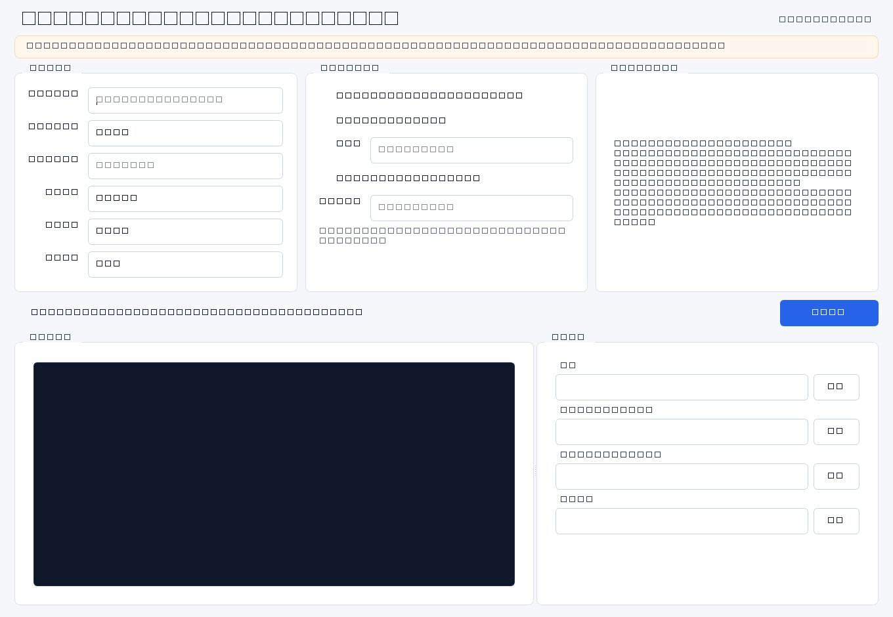

# VPS 3x-ui Reality Deployer

一款 Windows 本地 PyQt6 工具，用于在**已授权**的 VPS 上自动部署 3x-ui，配置 `VLESS + TCP + REALITY + xtls-rprx-vision`，开启 `BBR / UFW`，并生成 Clash Verge / Shadowrocket 订阅链接与 Markdown 记录。

> 仅供学习参考。仅限你本人拥有或被明确授权管理的 VPS。请遵守所在地法律法规、云服务商条款与网络使用规范，不得用于违法违规用途。

## 主要功能

- 后台线程部署，界面不会卡死
- SSH 一键连接单台 VPS
- 自动安装或覆盖部署 3x-ui
- 自动生成节点、订阅和部署记录
- 启用 `BBR + fq`
- 配置 `UFW`
- 可选写入 SSH 密码、修改 root 密码、限制面板来源 IP

## 界面预览



## 快速上手

1. 在 `VPS IP` 填目标机公网 IPv4。
2. `SSH 用户` 默认是 `root`，输入实例密码。
3. 端口一般保持默认：`32105 / 2096 / 443`。
4. 勾选授权确认。
5. 点击 `开始部署`，等待日志完成。
6. 部署结束后复制面板地址和订阅链接，记录文件会自动生成。

### 字段说明

| 字段 | 说明 |
| --- | --- |
| `VPS IP` | 目标 VPS 的公网 IPv4 |
| `SSH 用户` | 默认 `root` |
| `SSH 密码` | 实例控制台给出的密码 |
| `面板端口` | 3x-ui 管理面板 HTTPS 端口 |
| `订阅端口` | Clash / Shadowrocket 订阅端口 |
| `节点端口` | VLESS Reality 入站端口，默认 `443` |

## 输出内容

- 3x-ui 面板地址、账号和密码
- Clash Verge 订阅链接
- Shadowrocket 订阅链接
- Markdown 部署记录：`deployment_records/vps-<ip>-deployment.md`

## 技术说明

- 协议：`VLESS + TCP + REALITY + xtls-rprx-vision`
- 节点参数：`UUID`、`Reality key`、`ShortId`、`SubId` 每次重新生成
- 证书：IP 证书
- 系统优化：`BBR + fq`
- 防火墙：UFW 放行 `22 / 80 / 443 / 2096 / 32105`

## 教程

1. 填写 VPS 的 IP 和 SSH 密码。
2. 确认端口配置无误，通常直接保持默认值。
3. 勾选“我确认此 VPS...”的授权项。
4. 点击 `开始部署`。
5. 等待实时控制台输出完成部署、验证和记录写入。
6. 复制结果区里的面板、Clash Verge 和 Shadowrocket 链接。

## 选型参考

如果你在找合适的 VPS，可以参考这个推广入口：

[NovixLink 推荐入口](https://novixlink.com/aff.php?aff=84)

说明：这是带推广参数的链接，用于支持项目维护。

根据官网当前信息，NovixLink 主打美国 ISP 住宅 IP VPS、BGP 国际线路 VPS 和 IDC 机房 VPS，页面强调 `Tier-1` 网络、原生住宅 IP、`NVMe` 存储、`KVM` 虚拟化和多档位套餐。更适合需要海外网络连通性、稳定公网环境或美国住宅 IP 场景的用户。具体套餐与价格以官网实时页面为准。

## 构建

```bash
pip install -r requirements.txt
pyinstaller VPS_Reality_Deployer.spec
```

## Release

发布版本会附带 Windows 单文件程序 `VPS_Reality_Deployer.exe`。

## 作者

CraigChu
